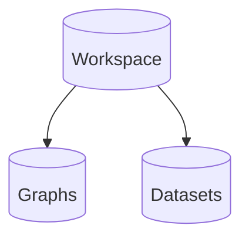

# AnaTools

## Project Description
Anatools is a python package with modules for developing with the Ana Platform from Rendered.AI.
With AnaTools you can generate and access synthetic datasets, and much more!
```python
>>> import anatools
>>> ana = anatools.AnaClient()
'Enter your credentials for Ana.'
'email:' example@rendered.ai
'password:' ***************
'Signed into Ana with example@rendered.ai, using workspace 123456789.'
>>> ana.get_channels()
['mychannel1', 'mychannel2']
>>> graphs = ana.get_graphs()
>>> datasets = ana.get_datasets()
```

<br /><br />
## Install the AnaTools Package
#### (Optional) Create a new Conda Environment
1. Install conda for your operating system: https://www.anaconda.com/products/individual.
2. Create a new conda environment and activate it.
3. Install anatools from the Python Package Index.
```sh
$ conda create -n renderedai python=3.7
$ conda activate renderedai
```
#### Install AnaTools to the Python Environment
1. Install AnaTools from the Python Package Index.
```sh
$ pip install anatools
```
#### Dependencies
The anatools package requires python 3.6 or higher and has dependencies on the following packages:
| Package | Description |
|-|-|
| pyrebase| A python wrapper for Google Firebase API. |
| keyring | A python library for storing and accessing passwords securely. |

If you have any questions or comments, contact Rendered.AI at info@rendered.ai.

<br /><br />
## Quickstart Guide
#### What is Ana?
Ana is a synthetic dataset generation tool where graphs describe what and how synthetic datasets are generated.
| Terms | Definitions |
|-|-|
| workspace | A workspace is a collection of data used for a particular use-case, for example workspaces can be used to organize data for different projects.
| dataset | A dataset is a collection of data, for many use-cases these are images with text-based annotation files. |
| graph | A graph is defined by nodes and links, it describes the what and the how a dataset is generated. |
| node | A node can be described as an executable block of code, it has inputs and runs some algorithm to generate outputs. |
| link | A link is used to transfer data from the output of one node, to the input of other nodes. |
| channel | A channel is a collection of nodes, it is used to limit the scope of what is possible to generate in a dataset (like content from a tv channel). |

#### How do you use Ana?
Ana creates synthetic datasets by processing a graph, so we will need to create our Ana client, create a graph, then create a dataset.
1. Create a client and login to Ana.
In this example we are instantiating a client with no workspace or environment variables, so it is setting our default workspace.
To access the tool, you will need to use your email and password for https://deckard.rendered.ai.
```python
>>> from anatools import AnaClient
>>> ana = anatools.AnaClient()
'Enter your credentials for Ana.'
'email:' example@rendered.ai
'password:' ***************
'Signed into Ana with example@rendered.ai, using workspace 123456789.'
```
2. Define a graph. 
We are defining a simplistic graph for this example with a camera and sphere.
Graphs are usually stored in json or yaml format, but read into a python dictionary to be passed to the API.
```yaml
nodes:

  Sphere:
    class: Sphere
    inputs:
      Size: 1

  SphereLocation:
    class: SetObjectLocation
    inputs:
      Object: {$link: [Sphere, Object]}
      Location: [0,0,0]

  Camera:
    class: Camera
    inputs:
      Resolution: [1920,1080]
      FOV: 29.0

  CameraLocation:
    class: SetObjectLocation
    inputs:
      Object: {$link: [Camera, Object]}
      Location: [0,0,0]
  
  Render:
    class: Render
    inputs:
      Camera: {$link: [CameraLocation, Object]}
      Scene: {$link: [SphereLocation, Object]}
```
3. Create a graph using the client.
To creat new graph, we load the graph defined above into a python dictionary using the yaml python package.
Then we create a graph using the client, this graph is being name 'testgraph' and is using the 'channelA' channel.
The client will return a graphid so we can reference this graph later.
```python
>>> import yaml
>>> with open('graph.yml') as graphfile:
>>>     graph = yaml.load(graphfile)
>>> graphid = ana.create_graph(name='testgraph',channel='channelA',graph=graph)
>>> graphid
'e175a44e-23a5-11eb-adc1-0242ac120002'
```
4. Create a dataset using the client.
Using the graphid, we can create a new job to generate a dataset.

The client will return a datasetid that can be used for reference later.
``` python
>>> datasetid = ana.create_dataset(name='testdataset',interpretations=10,description='A simple dataset with a sphere.')
>>> datasetid
'ce66e81c-23a6-11eb-adc1-0242ac120002 '
```

</br></br>
#### Data Structure
